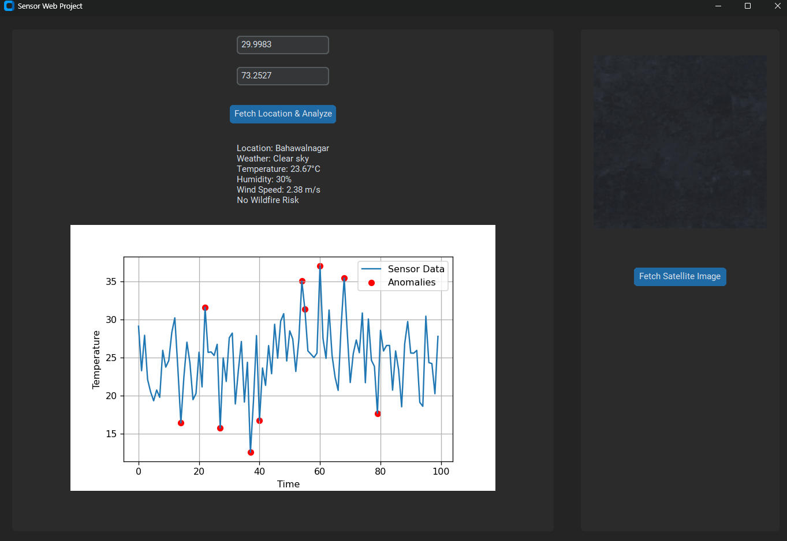

# Sensor Web Project

This project is a graphical user interface (GUI) application built using Python and `customtkinter`. It integrates APIs from NASA and OpenWeather to create a network of sensors capable of retrieving satellite images, weather data, and other environmental observations based on user-provided coordinates. The project also includes an anomaly detection feature using `IsolationForest` to analyze sensor data.

## Table of Contents

- [Introduction](#introduction)
- [Objectives](#objectives)
- [System Architecture](#system-architecture)
- [Features](#features)
- [Technologies Used](#technologies-used)
- [Installation](#installation)
- [Usage](#usage)
- [Configuration](#configuration)
- [Project Structure](#project-structure)
- [Results](#results)
- [Limitations](#limitations)
- [Future Enhancements](#future-enhancements)
- [Contributing](#contributing)
- [License](#license)
- [References](#references)

---

## Introduction

The Sensor Web Project is designed to simulate a network of sensors capable of real-time data acquisition and analysis. It serves as a prototype for autonomous observation systems, demonstrating how satellite imagery and weather data can be integrated for environmental monitoring.



## Objectives

- Build a software system to integrate satellite and weather data from external APIs.
- Visualize sensor data and detect anomalies using machine learning techniques.
- Provide an intuitive graphical user interface for interaction.

## System Architecture

The system includes:

1. **Data Acquisition**: Uses NASA Earth Assets API for satellite images and OpenWeather API for weather data.
2. **Data Processing**: Generates synthetic sensor readings and detects anomalies using the `IsolationForest` algorithm.
3. **Visualization**: Displays sensor data and satellite images using `matplotlib` and `PIL`.

## Features

- **Sensor Data Simulation**: Generates synthetic temperature data using `numpy`.
- **Anomaly Detection**: Detects anomalies using `IsolationForest` from `scikit-learn`.
- **Satellite Imagery**: Retrieves images from the NASA Earth Assets API based on user coordinates.
- **Weather Data**: Fetches current weather conditions using OpenWeather API.
- **Interactive GUI**: Allows users to input coordinates and view real-time results.

## Technologies Used

- Python
- `customtkinter` for the GUI
- `requests` for API calls
- `scikit-learn` for anomaly detection
- `matplotlib` for plotting graphs
- `PIL` (Pillow) for image handling
- NASA Earth Assets API
- OpenWeather API

## Installation

1. **Clone the repository**:

   ```bash
   git clone https://github.com/yourusername/sensor-web-project.git
   cd sensor-web-project

## usage

- Enter Latitude and Longitude: The application fetches satellite images and weather data for the specified coordinates.
- Generate Sensor Data: Simulates a set of sensor readings.
- Anomaly Detection: Analyzes the generated sensor data and identifies anomalies.

## Configuration

- Ensure your environment is properly set up with the required API keys.
- Adjust parameters like sensor data count or plotting dimensions if needed.

## Project Structure

- sensor-web-project
- main.py                Main entry point of the application.
- requirements.txt       List of dependencies.
- README.md              Project documentation.

## Results

- The project demonstrates successful integration of real-world data from external APIs with simulated sensor data. It provides:

- Real-time visualization of satellite images based on user inputs.
- Accurate weather data retrieval for any location worldwide.
- Detection of outliers in sensor data, highlighting potential anomalies.

## Limitations

- Requires API keys with potential usage limits.
- Relies on internet connectivity for data fetching.
- Synthetic sensor data may not fully represent real-world conditions.

## Future Enhancements

- Integrate more advanced machine learning models for anomaly detection.
- Expand the sensor network to include additional environmental data like air quality.
- Implement a database for historical data storage.
-Develop a web-based version for broader accessibility.

## Contributing

Feel free to submit issues, fork the repository, and create pull requests.

## License

This project is licensed under the MIT License.

## References

- [NASA Earth Assets API](https://api.nasa.gov)
- [OpenWeather API](https://openweathermap.org/api)
- [scikit-learn Documentation](https://scikit-learn.org)
